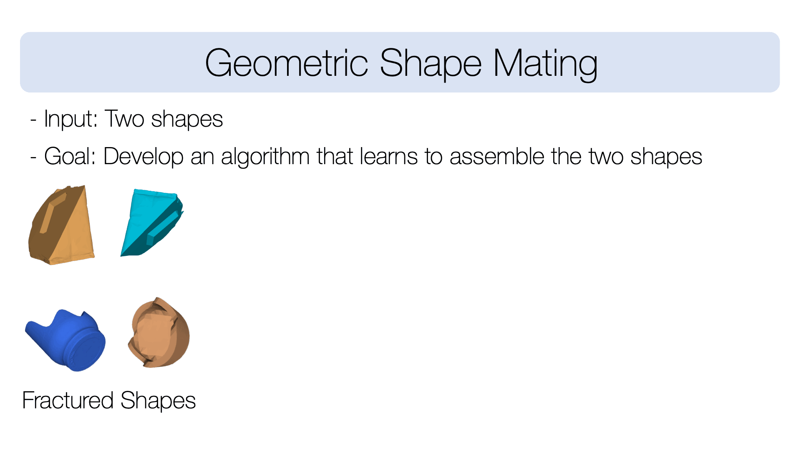

# Neural Shape Mating: Self-Supervised Object Assembly with Adversarial Shape Priors

This repository contains code for the paper Neural Shape Mating: Self-Supervised Object Assembly with Adversarial Shape Priors.

Correspondence: Yun-Chun Chen ycchen@cs.toronto.edu



## Abstract
Learning to autonomously assemble shapes is a crucial skill for many robotic applications. While the majority of existing part assembly methods focus on correctly posing semantic parts to recreate a whole object, we interpret assembly more literally: as mating geometric parts together to achieve a snug fit. By focusing on shape alignment rather than semantic cues, we can achieve across category generalization and scaling. In this paper, we introduce a novel task, pairwise 3D geometric shape mating, and propose Neural Shape Mating (NSM) to tackle this problem. Given point clouds of two object parts of an unknown category, NSM learns to reason about the fit of the two parts and predict a pair of 3D poses that tightly mate them together. In addition, we couple the training of NSM with an implicit shape reconstruction task, making NSM more robust to imperfect point cloud observations. To train NSM, we present a self-supervised data collection pipeline that generates pairwise shape mating data with ground truth by randomly cutting an object mesh into two parts, resulting in a dataset that consists of 200K shape mating pairs with numerous object meshes and diverse cut types. We train NSM on the collected dataset and compare it with several point cloud registration methods and one part assembly baseline approach. Extensive experimental results and ablation studies under various settings demonstrate the effectiveness of the proposed algorithm.

## Citation
If you find our code useful, please consider citing our work using the following bibtex:
```
@inproceedings{NSM,
  title={Neural Shape Mating: Self-Supervised Object Assembly with Adversarial Shape Priors},
  author={Chen, Yun-Chun and Li, Haoda and Turpin, Dylan and Jacobson, Alec and Garg, Animesh},
  booktitle={IEEE Conference on Computer Vision and Pattern Recognition (CVPR)},
  year={2022}
}
```

## Environment
 - Ubuntu 18.04
 - Install Anaconda Python3.7
 - Code is tested on 4 NVIDIA P100 GPUs
 

## Dataset generation
 - Please see the `data_generation` folder for data generation code.
 - Code is implemented in C++ and relies on [libigl](https://github.com/libigl/libigl).
 - Please follow the instructions [here](https://libigl.github.io/) for package installation and compiling instructions.


## Object meshes
 - We use object meshes from [Thingi10K](https://ten-thousand-models.appspot.com/), [Google Scanned Objects](https://arxiv.org/abs/2204.11918), and [ShapeNet](https://shapenet.org/).
 - Please download object meshes from their original websites.
 - Please follow the license for each dataset as specified in their website.


## Training
 - The training code is provided in the `script` folder.
 - Please modify the respective parameters in `config/train.yml`
 - Note: You will need at least 4 NVIDIA P100 GPUs to run the script.


## Acknowledgment
 - [PyTorch](https://pytorch.org/)
 - [libigl](https://libigl.github.io/)
 - [Deep Closest Point](https://arxiv.org/abs/1905.03304)
 - [3D Part Assembly](https://arxiv.org/abs/2003.09754)
 - [Dynamic Graph Learning for Assembly](https://arxiv.org/abs/2006.07793)
 - [Open3D](http://www.open3d.org/)
 - [Iterative Closest Points](http://www.open3d.org/docs/release/tutorial/pipelines/icp_registration.html)
 - [Sparse Iterative Closest Points](https://github.com/OpenGP/sparseicp)